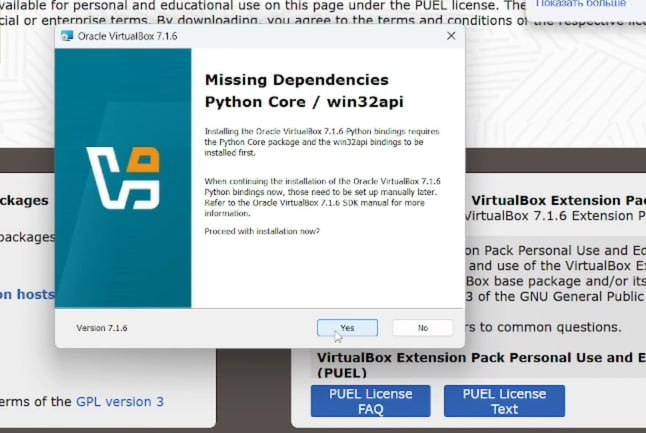
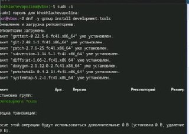
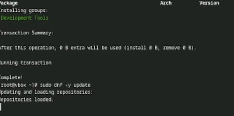
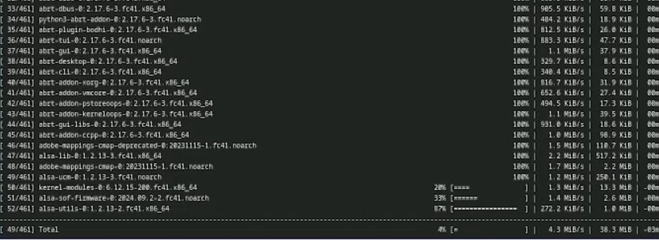
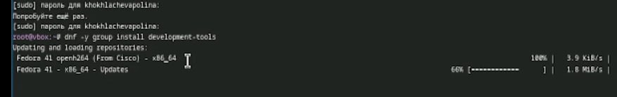
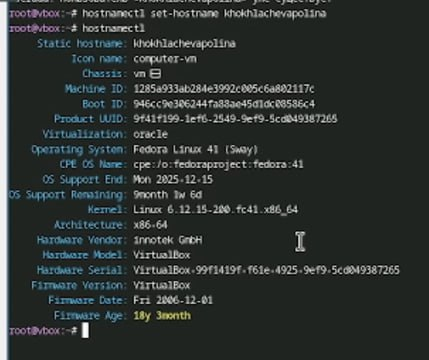
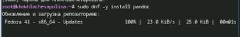
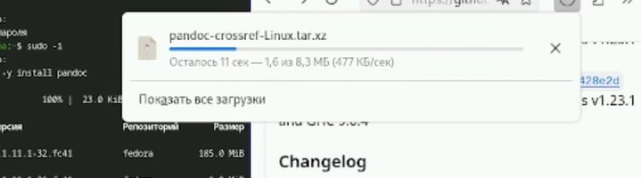
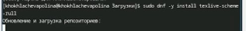
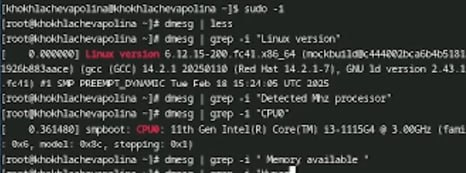

---
## Front matter
lang: ru-RU
title: Лабораторная работа № 1
subtitle: Установка и конфигурация операционной системы на виртуальную машину
author:
  - Хохлачёва П.Д.
institute:
  - Российский университет дружбы народов, Москва, Россия

## i18n babel
babel-lang: russian
babel-otherlangs: english

## Formatting pdf
toc: false
toc-title: Содержание
slide_level: 2
aspectratio: 169
section-titles: true
theme: metropolis
header-includes:
 - \metroset{progressbar=frametitle,sectionpage=progressbar,numbering=fraction}
---

## 

Процесс установки VirtualBo9

## 

установка драйверов и средств разработки

## 

Установка средств разработки

# 

Обновление всех пакетов

## 

Установка средств разработки

##

Создаём пользователя

## 

Устанавливаем хост имя и проверяем его

## 

Установка pandoc

## 

Установка нужного pandoc

## 

Установка TexLive

## 

Выполнение домашнего задания, получение информации

