---
## Front matter
title: "Лабораторная работа № 1"
subtitle: "Установка ОС Linux."
author: "Хохлачёва Полина Дмитриевна"

## Generic otions
lang: ru-RU
toc-title: "Содержание"

## Bibliography
bibliography: bib/cite.bib
csl: pandoc/csl/gost-r-7-0-5-2008-numeric.csl

## Pdf output format
toc: true # Table of contents
toc-depth: 2
lof: true # List of figures
lot: true # List of tables
fontsize: 12pt
linestretch: 1.5
papersize: a4
documentclass: scrreprt
## I18n polyglossia
polyglossia-lang:
  name: russian
  options:
	- spelling=modern
	- babelshorthands=true
polyglossia-otherlangs:
  name: english
## I18n babel
babel-lang: russian
babel-otherlangs: english
## Fonts
mainfont: IBM Plex Serif
romanfont: IBM Plex Serif
sansfont: IBM Plex Sans
monofont: IBM Plex Mono
mathfont: STIX Two Math
mainfontoptions: Ligatures=Common,Ligatures=TeX,Scale=0.94
romanfontoptions: Ligatures=Common,Ligatures=TeX,Scale=0.94
sansfontoptions: Ligatures=Common,Ligatures=TeX,Scale=MatchLowercase,Scale=0.94
monofontoptions: Scale=MatchLowercase,Scale=0.94,FakeStretch=0.9
mathfontoptions:
## Biblatex
biblatex: true
biblio-style: "gost-numeric"
biblatexoptions:
  - parentracker=true
  - backend=biber
  - hyperref=auto
  - language=auto
  - autolang=other*
  - citestyle=gost-numeric
## Pandoc-crossref LaTeX customization
figureTitle: "Рис."
tableTitle: "Таблица"
listingTitle: "Листинг"
lofTitle: "Список иллюстраций"
lotTitle: "Список таблиц"
lolTitle: "Листинги"
## Misc options
indent: true
header-includes:
  - \usepackage{indentfirst}
  - \usepackage{float} # keep figures where there are in the text
  - \floatplacement{figure}{H} # keep figures where there are in the text
---

# Цель работы

Целью данной работы является приобретение практических навыков установки операционной системы на виртуальную машину, настройки минимально необходимых для дальнейшей работы сервисов.

 
# Выполнение лабораторной работы

Процесс установки VirtualBox(рис. [-@fig:001]).

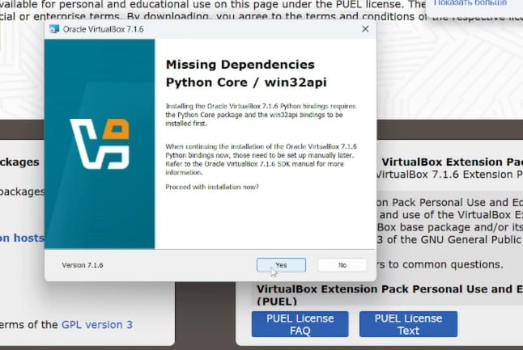{#fig:001 width=70%}

Установка драйверов и средств разработки(рис. [-@fig:002]).

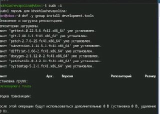{#fig:002 width=70%}

Установка средств разработки(рис. [-@fig:003]).

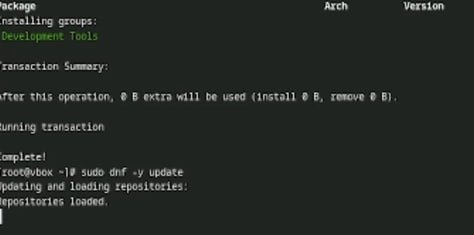{#fig:003 width=70%}

Обновление всех пакетов(рис. [-@fig:004]).

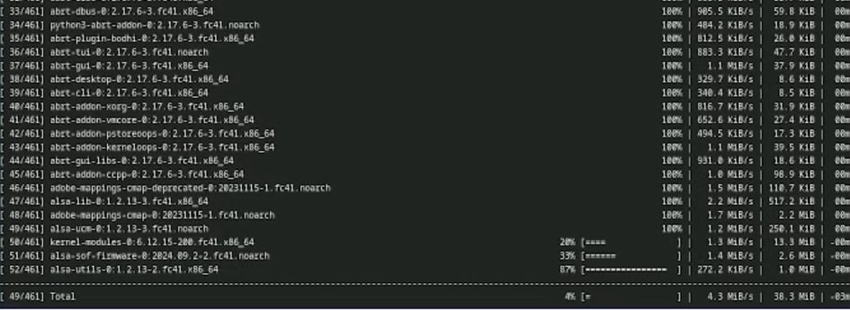{#fig:004 width=70%}

Установка средств разработки(рис. [-@fig:005]).

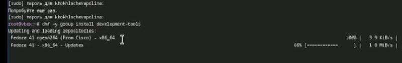{#fig:005 width=70%}

Создаём пользователя(рис. [-@fig:006]).

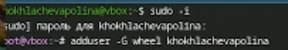{#fig:006 width=70%}

Устанавливаем хост имя и проверяем его(рис. [-@fig:007]).

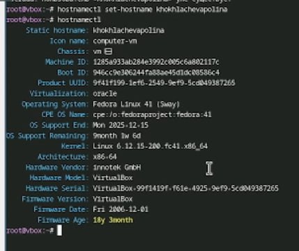{#fig:007 width=70%}

Установка pandoc(рис. [-@fig:008]).

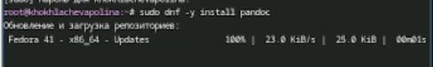{#fig:008 width=70%}

Установка нужного pandoc(рис. [-@fig:009]).

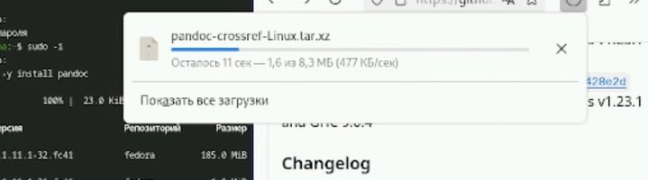{#fig:009 width=70%}

Установка TexLive(рис. [-@fig:010]).

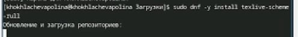{#fig:010 width=70%}

Выполнение домашнего задания, получение информации(рис. [-@fig:011]).

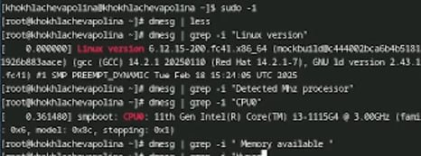{#fig:011 width=70%}

Ответы на вопросы 
1. Учетная запись пользователя

Логин, UID, GID, домашний каталог, shell, права, пароль (/etc/shadow).

2. Команды терминала

Справка: man <команда>, <команда> --help
Перемещение: cd <путь>, cd .., cd -
Содержимое каталога: ls, ls -l, ls -a
Размер каталога: du -sh <каталог>, df -h
Создание/удаление: mkdir, rmdir, rm -r, touch, rm
Права: chmod, chown, ls -l
История: history, !<номер>, Ctrl + R

3. Файловая система

Способ хранения данных.

Примеры:
 • ext4 (Linux), NTFS (Windows), FAT32 (универсальная, 4 ГБ макс.), XFS (большие объемы).

4. Просмотр ФС
 • mount, df -T

5. Удаление процесса
 • kill <PID>, kill -9 <PID>, pkill <имя>, htop

# Выводы

В данной работе мы  приобрели практические навыки установки операционной системы на виртуальную машину, настройки минимально необходимых для дальнейшей работы сервисов.

::: {#refs}
:::
