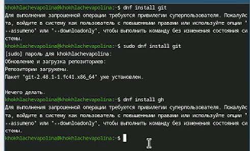
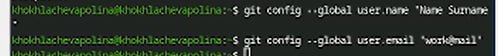
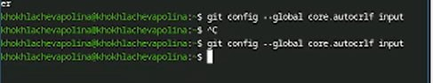
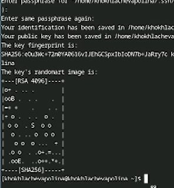
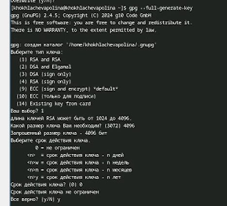
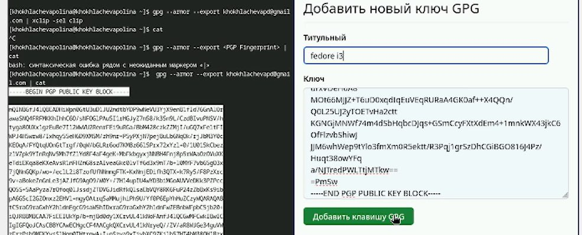
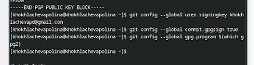
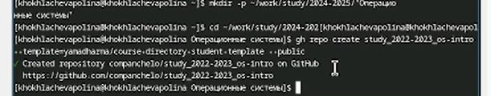
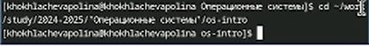
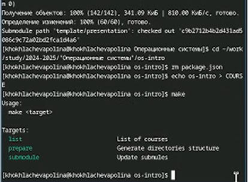

---
## Front matter
lang: ru-RU
title: Лабораторная работа №2
subtitle: Продвинутое использование git.
author:
  - Хохлачёва П.Д.
institute:
  - Российский университет дружбы народов, Москва, Россия

## i18n babel
babel-lang: russian
babel-otherlangs: english

## Formatting pdf
toc: false
toc-title: Содержание
slide_level: 2
aspectratio: 169
section-titles: true
theme: metropolis
header-includes:
 - \metroset{progressbar=frametitle,sectionpage=progressbar,numbering=fraction}
---

## 

Установка программного обеспечения

## 

Задаём имя и email репозитория

## 

Параметры

## 

Создание ключей

## 

создание ключей pgp

## 

добавляем ключ

## 

настройка подписей

## 

создание репозитория на основе шаблона

## 

удаление лишних файлов и создание необходимых каталогов

##  

отправляем файл

