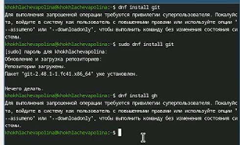
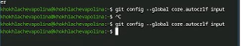
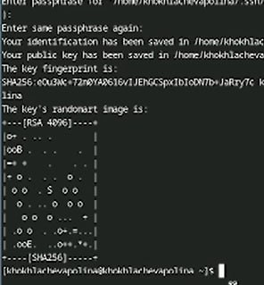
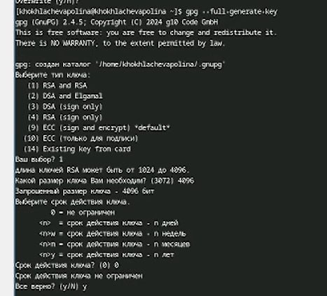
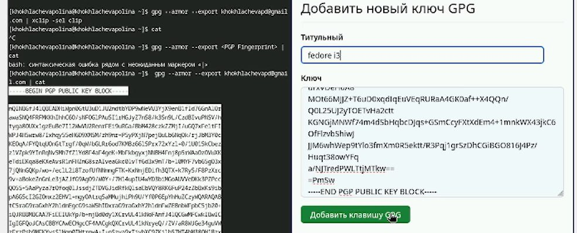
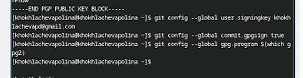
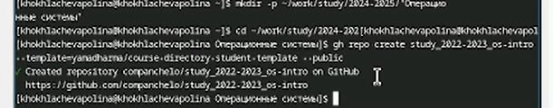
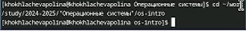
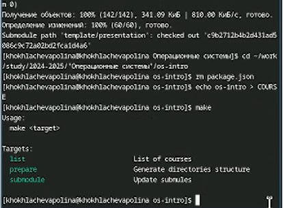
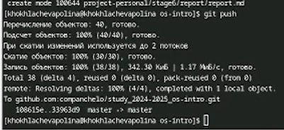

---
## Front matter
title: "Лабораторная работа №2"
subtitle: "Первоначальна настройка git."
author: "Хохлачёва Полина Дмитриевна"

## Generic otions
lang: ru-RU
toc-title: "Содержание"

## Bibliography
bibliography: bib/cite.bib
csl: pandoc/csl/gost-r-7-0-5-2008-numeric.csl

## Pdf output format
toc: true # Table of contents
toc-depth: 2
lof: true # List of figures
lot: true # List of tables
fontsize: 12pt
linestretch: 1.5
papersize: a4
documentclass: scrreprt
## I18n polyglossia
polyglossia-lang:
  name: russian
  options:
	- spelling=modern
	- babelshorthands=true
polyglossia-otherlangs:
  name: english
## I18n babel
babel-lang: russian
babel-otherlangs: english
## Fonts
mainfont: IBM Plex Serif
romanfont: IBM Plex Serif
sansfont: IBM Plex Sans
monofont: IBM Plex Mono
mathfont: STIX Two Math
mainfontoptions: Ligatures=Common,Ligatures=TeX,Scale=0.94
romanfontoptions: Ligatures=Common,Ligatures=TeX,Scale=0.94
sansfontoptions: Ligatures=Common,Ligatures=TeX,Scale=MatchLowercase,Scale=0.94
monofontoptions: Scale=MatchLowercase,Scale=0.94,FakeStretch=0.9
mathfontoptions:
## Biblatex
biblatex: true
biblio-style: "gost-numeric"
biblatexoptions:
  - parentracker=true
  - backend=biber
  - hyperref=auto
  - language=auto
  - autolang=other*
  - citestyle=gost-numeric
## Pandoc-crossref LaTeX customization
figureTitle: "Рис."
tableTitle: "Таблица"
listingTitle: "Листинг"
lofTitle: "Список иллюстраций"
lotTitle: "Список таблиц"
lolTitle: "Листинги"
## Misc options
indent: true
header-includes:
  - \usepackage{indentfirst}
  - \usepackage{float} # keep figures where there are in the text
  - \floatplacement{figure}{H} # keep figures where there are in the text
---

# Цель работы

    Изучить идеологию и применение средств контроля версий.Освоить умения по работе с git.

# Выполнение лабораторной работы

 Установка программного обеспечения(рис. [-@fig:001]).

{#fig:001 width=70%}

Задаём имя и email репозитория(рис. [-@fig:002]).

{#fig:002 width=70%}

Параметры(рис. [-@fig:003]).

{#fig:003 width=70%}

Создание ключей(рис. [-@fig:004]).

{#fig:004 width=70%}

создание ключей pgp(рис. [-@fig:005]).

{#fig:005 width=70%}

добавляем ключ(рис. [-@fig:006]).

{#fig:006 width=70%}

настройка подписей(рис. [-@fig:007]).

{#fig:007 width=70%}

создание репозитория на основе шаблона(рис. [-@fig:008]).

{#fig:008 width=70%}

настройка каталога курса(рис. [-@fig:009]).

{#fig:009 width=70%}

удаление лишних файлов и создание необходимых каталогов(рис. [-@fig:010]).

{#fig:0010 width=70%}

отправляем файл(рис. [-@fig:011]).

{#fig:0011 width=70%}

Ответы на вопросы 

▎1. Что такое системы контроля версий (VCS) и для решения каких задач они предназначаются?

Системы контроля версий (Version Control Systems, VCS) — это инструменты, которые позволяют отслеживать изменения в файлах и координировать работу нескольких людей над одним проектом. Основные задачи, которые решают VCS, включают:

• Отслеживание изменений в коде и других файлах.

• Сохранение историй изменений, что позволяет откатываться к предыдущим версиям.

• Совместная работа над проектом несколькими разработчиками.

• Управление конфликтами при одновременной работе нескольких пользователей над одним файлом.

▎2. Объясните следующие понятия VCS и их отношения: хранилище, commit, история, рабочая копия.

• Хранилище (repository) — это место, где хранятся все версии проекта, включая файлы и их изменения.

• Commit — это операция, которая сохраняет текущее состояние файлов в хранилище, фиксируя изменения с комментарием, описывающим эти изменения.

• История — это последовательность всех коммитов в репозитории, позволяющая отслеживать, какие изменения были внесены и когда.

• Рабочая копия (working copy) — это локальная версия файлов проекта, с которой разработчик работает на своем компьютере. Она может содержать изменения, которые еще не были зафиксированы (commit).

▎3. Что представляют собой и чем отличаются централизованные и децентрализованные VCS? Приведите примеры VCS каждого вида.

• Централизованные VCS: Все изменения хранятся на одном центральном сервере. Пользователи получают доступ к этому серверу для получения последних изменений и отправки своих. Пример: Subversion (SVN), CVS.

  
• Децентрализованные VCS: Каждый разработчик имеет полную копию репозитория, включая всю историю изменений. Это позволяет работать офлайн и синхронизировать изменения с другими разработчиками по мере необходимости. Пример: Git, Mercurial.

▎4. Опишите действия с VCS при единоличной работе с хранилищем.

При единоличной работе с VCS разработчик обычно выполняет следующие действия:

1. Создание репозитория: Инициализация нового репозитория с помощью команды git init.

2. Работа с файлами: Создание или редактирование файлов в рабочей копии.

3. Добавление изменений: Использование команды git add для добавления измененных файлов в индекс.

4. Коммит изменений: Фиксация изменений с помощью команды git commit.

5. Просмотр истории: Использование команды git log для просмотра истории коммитов.

6. Откат изменений: При необходимости можно откатить изменения к предыдущему коммиту.

▎5. Опишите порядок работы с общим хранилищем VCS.

При работе с общим хранилищем VCS порядок действий может быть следующим:

1. Клонирование репозитория: Получение копии удаленного репозитория с помощью git clone.

2. Создание новой ветки: Создание новой ветки для работы над новой функцией или исправлением.

3. Внесение изменений: Работа с файлами в рабочей копии.

4. Добавление и коммит изменений: Использование git add и git commit для сохранения изменений.

5. Синхронизация с удаленным репозиторием: Использование git pull для получения последних изменений из удаленного репозитория.

6. Отправка изменений: Использование git push для отправки своих коммитов в удаленный репозиторий.

▎6. Каковы основные задачи, решаемые инструментальным средством git?

Основные задачи Git включают:

• Отслеживание изменений в коде.

• Ведение истории всех изменений.

• Управление ветвями и слияниями.

• Поддержка совместной работы нескольких разработчиков.

• Упрощение отката изменений и исправления ошибок.

▎7. Назовите и дайте краткую характеристику командам git.

• git init: Инициализация нового репозитория.

• git clone: Клонирование удаленного репозитория.

• git add: Добавление изменений в индекс для последующего коммита.

• git commit: Фиксация изменений в локальном репозитории.

• git status: Просмотр статуса рабочей копии (изменения, которые еще не закоммичены).

• git log: Просмотр истории коммитов.
# Выводы

Мы изучили идеологию и применение средств контроля версий.Освоили умения по работе с git.

