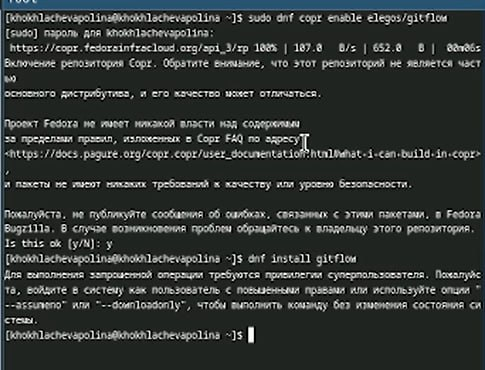
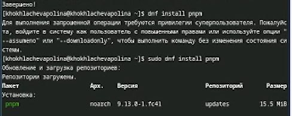
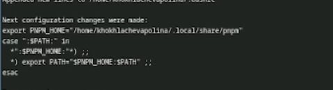
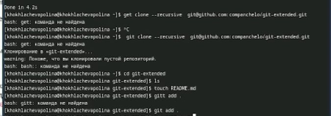
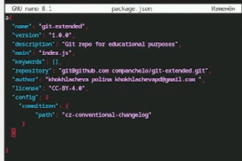
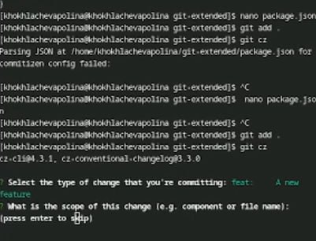
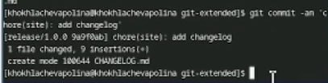

---
## Front matter
lang: ru-RU
title: Лабораторная работа №4
subtitle: Продвинутое использование git.
author:
  - Хохлачёва П.Д.
institute:
  - Российский университет дружбы народов, Москва, Россия

## i18n babel
babel-lang: russian
babel-otherlangs: english

## Formatting pdf
toc: false
toc-title: Содержание
slide_level: 2
aspectratio: 169
section-titles: true
theme: metropolis
header-includes:
 - \metroset{progressbar=frametitle,sectionpage=progressbar,numbering=fraction}
---

## 

Распаковка пакета

## 

Задаём имя

## 

клонирование в blog

## 

Загрузка go

## 

загрузка hugo server

## 

запуск сайта

## 

удаление public

