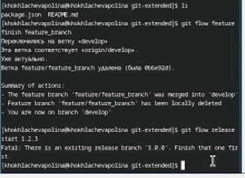
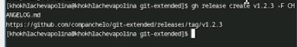

---
## Front matter
lang: ru-RU
title: Лабораторная работа №4
subtitle: Продвинутое использование git.
author:
  - Хохлачёва П.Д.
institute:
  - Российский университет дружбы народов, Москва, Россия

## i18n babel
babel-lang: russian
babel-otherlangs: english

## Formatting pdf
toc: false
toc-title: Содержание
slide_level: 2
aspectratio: 169
section-titles: true
theme: metropolis
header-includes:
 - \metroset{progressbar=frametitle,sectionpage=progressbar,numbering=fraction}
---

## git 

установка git

## git 

Установка Node.js

## git 

общепринятые коммиты

## git 

Создание репозитория git

## git 

Заполняем параметры пакета

## git 

Конфигурация

## git 

добавление в журнал

## git 

работа с репозиторием

## git 

отправляем данные

## git 

создаём релиз

