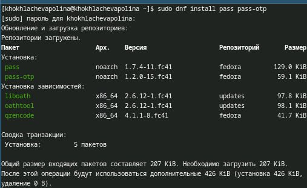
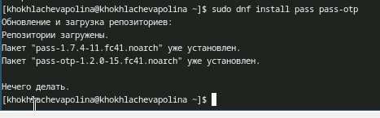
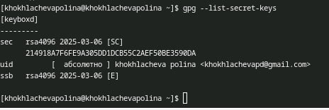
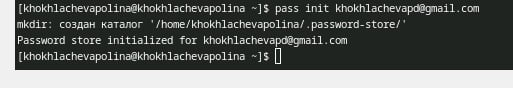
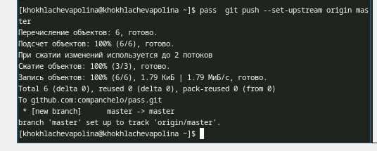
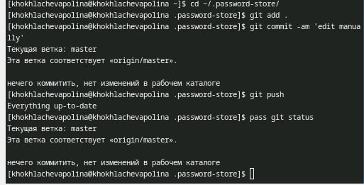
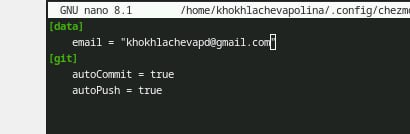

---
## Front matter
lang: ru-RU
title: Лабораторная работа № 5
subtitle: Настройка рабочей среды
author:
  - Хохлачёва П.Д.
institute:
  - Российский университет дружбы народов, Москва, Россия

## i18n babel
babel-lang: russian
babel-otherlangs: english

## Formatting pdf
toc: false
toc-title: Содержание
slide_level: 2
aspectratio: 169
section-titles: true
theme: metropolis
header-includes:
 - \metroset{progressbar=frametitle,sectionpage=progressbar,numbering=fraction}
---

## 

Установка

## 

Установка gopass

## 

Просмотр списка ключей

# 

Инициализация хранилища

## 

Синхронизация

##

Прямые изменения

## 

Добавляем в файл конфигурацию

