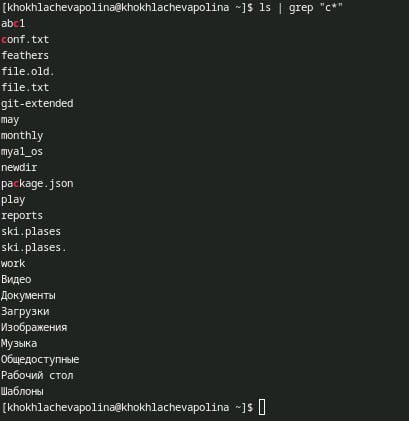
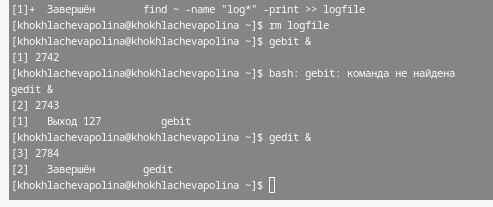
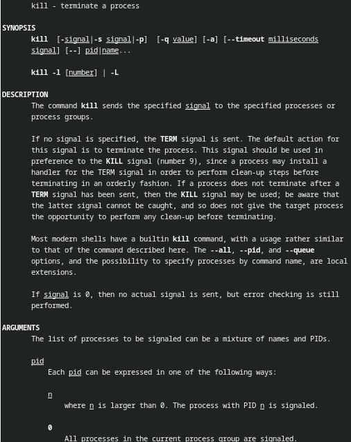
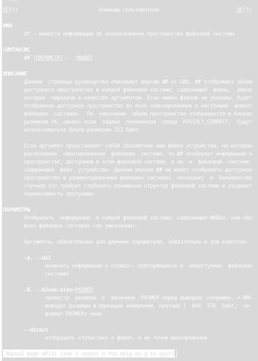
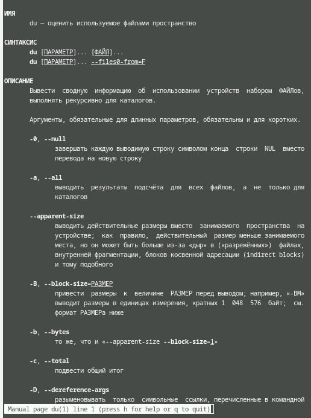
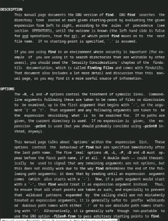

---
## Front matter
lang: ru-RU
title: Лабораторная работа № 8
subtitle: Поиск файлов. Перенаправление
ввода-вывода. Просмотр запущенных процессов:
author:
  - Хохлачёва П.Д.
institute:
  - Российский университет дружбы народов, Москва, Россия

## i18n babel
babel-lang: russian
babel-otherlangs: english

## Formatting pdf
toc: false
toc-title: Содержание
slide_level: 2
aspectratio: 169
section-titles: true
theme: metropolis
header-includes:
 - \metroset{progressbar=frametitle,sectionpage=progressbar,numbering=fraction}
---

## 

Определение файлов

## 

Определение индентификатора

## 

Прочтение терминала

## 

Сколько места используется в ОС

## 

Сколько суммарно

##

Именно всех директорий

##

Ознакомились с инструментами поиска файлов и фильтрации текстовых данных.
Приобрели практических навыков: по управлению процессами (и заданиями), по
проверке использования диска и обслуживанию файловых систем

