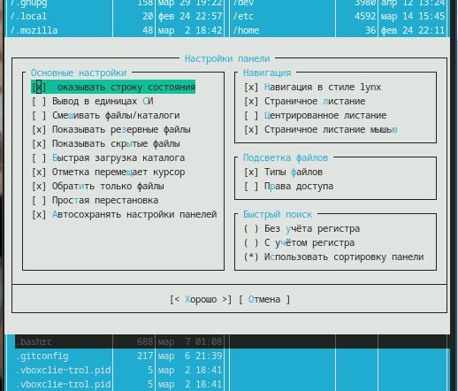
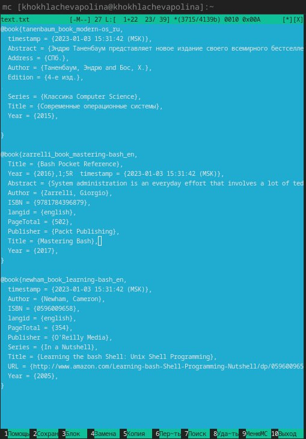

---
## Front matter
lang: ru-RU
title: Лабораторная работа № 9
subtitle: Поиск файлов. Перенаправление
ввода-вывода. Просмотр запущенных процессов:
author:
  - Хохлачёва П.Д.
institute:
  - Российский университет дружбы народов, Москва, Россия

## i18n babel
babel-lang: russian
babel-otherlangs: english

## Formatting pdf
toc: false
toc-title: Содержание
slide_level: 2
aspectratio: 169
section-titles: true
theme: metropolis
header-includes:
 - \metroset{progressbar=frametitle,sectionpage=progressbar,numbering=fraction}
---
## Цель работы 

Ознакомление с инструментами поиска файлов и фильтрации текстовых данных.
Приобретение практических навыков: по управлению процессами (и заданиями), по
проверке использования диска и обслуживанию файловых систем
## 

Изучаем структуру меню

## 

Поиск файлов

## 

Настройки

## 

Создаём файл

## 

Заполнение и работа с файлом

## Вывод

Мы познакомились с инструментами поиска файлов и фильтрации текстовых данных.
Приобрели практические навыки: по управлению процессами (и заданиями), по
проверке использования диска и обслуживанию файловых систем

