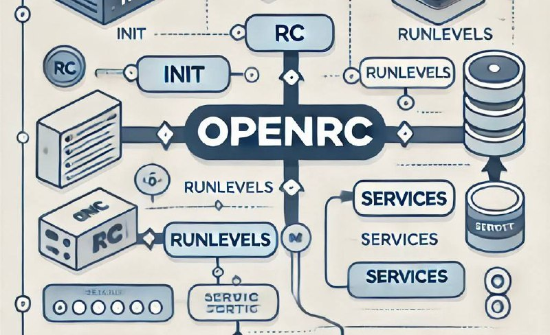
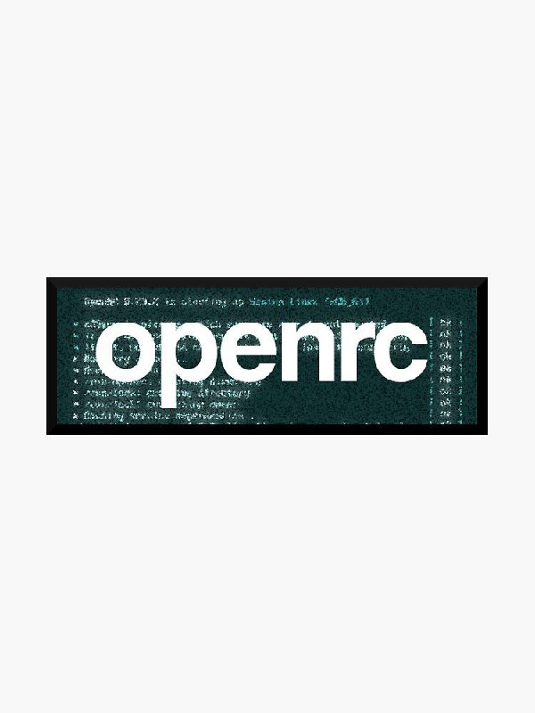

---
## Front matter
title: "Система инициализации OpenRC"
subtitle: "Реферат"
author: "Хохлачёва Полина Дмитриевна"

## Generic otions
lang: ru-RU
toc-title: "Содержание"

## Bibliography
bibliography: bib/cite.bib
csl: pandoc/csl/gost-r-7-0-5-2008-numeric.csl

## Pdf output format
toc: true # Table of contents
toc-depth: 2
lof: true # List of figures
fontsize: 12pt
linestretch: 1.5
papersize: a4
documentclass: scrreprt
## I18n polyglossia
polyglossia-lang:
  name: russian
  options:
	- spelling=modern
	- babelshorthands=true
polyglossia-otherlangs:
  name: english
## I18n babel
babel-lang: russian
babel-otherlangs: english
## Fonts
mainfont: IBM Plex Serif
romanfont: IBM Plex Serif
sansfont: IBM Plex Sans
monofont: IBM Plex Mono
mathfont: STIX Two Math
mainfontoptions: Ligatures=Common,Ligatures=TeX,Scale=0.94
romanfontoptions: Ligatures=Common,Ligatures=TeX,Scale=0.94
sansfontoptions: Ligatures=Common,Ligatures=TeX,Scale=MatchLowercase,Scale=0.94
monofontoptions: Scale=MatchLowercase,Scale=0.94,FakeStretch=0.9
mathfontoptions:
## Biblatex
biblatex: true
biblio-style: "gost-numeric"
biblatexoptions:
  - parentracker=true
  - backend=biber
  - hyperref=auto
  - language=auto
  - autolang=other*
  - citestyle=gost-numeric
## Pandoc-crossref LaTeX customization
figureTitle: "Рис."
tableTitle: "Таблица"
listingTitle: "Листинг"
lofTitle: "Список иллюстраций"
lolTitle: "Листинги"
## Misc options
indent: true
header-includes:
  - \usepackage{indentfirst}
  - \usepackage{float} # keep figures where there are in the text
  - \floatplacement{figure}{H} # keep figures where there are in the text
---

# Вводная часть

Уважаемые коллеги, сегодня я представлю доклад на тему «Система инициализации OpenRC».
Мы рассмотрим ключевые аспекты архитектуры OpenRC, её особенности и преимущества, а также актуальные задачи и направления исследования в этой области.

# Актуальность темы

Системы инициализации — это неотъемлемая часть любой операционной системы на базе Unix-подобных систем. Они отвечают за запуск и управление службами на этапе загрузки системы и в процессе её работы.
На фоне доминирования таких систем инициализации, как systemd, тема альтернативных решений, в частности OpenRC, приобретает особую значимость.
В последние годы растёт интерес к более лёгким, модульным и прозрачным системам управления службами. OpenRC, являясь одним из таких решений, активно используется в таких дистрибутивах, как Gentoo, Alpine Linux, Artix Linux и других.
Это делает тему не только теоретически интересной, но и практически значимой для широкого круга разработчиков и системных администраторов.

# Объект и предмет исследования
Объектом исследования является система инициализации OpenRC и её архитектура в контексте Unix-подобных операционных систем.

Предметом исследования выступают принципы работы OpenRC, её механизмы управления службами, структура и особенности взаимодействия с ядром и пользовательским пространством.

Научная новизна заключается в комплексном анализе OpenRC как современного инструмента управления службами, её сравнении с другими популярными системами инициализации, таких как SysVinit и systemd, а также в выявлении преимуществ и ограничений OpenRC при использовании в современных высоконагруженных и контейнеризированных средах.

# Практическая значимость работы

Практическая значимость заключается в следующем:
 • Возможность применения OpenRC в минималистичных и высокопроизводительных дистрибутивах Linux.
 • Обеспечение более простого и понятного управления службами по сравнению с более сложными системами.
 • Внедрение OpenRC в инфраструктуру позволяет повысить отказоустойчивость и снизить избыточность системных компонентов.

{#fig:001 width=70%}

# Цель, гипотеза, задачи исследования

Цель исследования — изучить архитектуру и возможности системы инициализации OpenRC, определить её преимущества, ограничения и сферы целесообразного применения.

Гипотеза — использование OpenRC позволяет упростить управление службами и повысить производительность системы без существенных потерь функциональности по сравнению с более сложными системами инициализации.

Задачи исследования:
 1. Проанализировать архитектуру OpenRC и принципы её работы.
 2. Сравнить OpenRC с другими системами инициализации.
 3. Оценить производительность и ресурсоёмкость OpenRC на практике.
 4. Разработать рекомендации по применению OpenRC в различных инфраструктурах.

# Материалы и методы и инструменты исследования, теоретическая база

Исследование опирается на:
 • Первичные источники: официальная документация OpenRC, исходные коды.
 • Вторичные источники: научные статьи, форумы, опыт сообществ Gentoo, Alpine Linux и Artix Linux.

Методы исследования:
 • Теоретический анализ архитектуры.
 • Эмпирические эксперименты — установка, настройка и тестирование OpenRC на различных конфигурациях.
 • Сравнительный анализ производительности с другими системами инициализации.
 
 Инструменты исследования:
 • Дистрибутивы Linux: Gentoo, Alpine Linux, Artix Linux.
 • Средства мониторинга: htop, systemd-analyze, time, ps, strace.
 • Инструменты виртуализации: QEMU, VirtualBox.
 
# Содержание исследования

OpenRC — это система инициализации и управления службами для Unix-подобных операционных систем. Она отвечает за запуск, остановку и контроль фоновых служб, необходимых для работы системы, а также за правильный порядок их запуска при загрузке.

Изначально OpenRC был создан для Gentoo Linux, но сегодня используется и в других дистрибутивах, например в Alpine Linux и Artix Linux.

Ключевые особенности OpenRC:
 • Совместимость с классическими shell-скриптами SysVinit.
 • Поддержка параллельного запуска служб для ускорения загрузки.
 • Лёгкость, независимость от D-Bus и низкое потребление ресурсов.
 • Удобное управление службами как при загрузке, так и в работающей системе.

OpenRC сочетает простоту традиционных систем с современными возможностями, что делает его удобным для серверов, рабочих станций и минималистичных систем.

# Предлагаемое решение задач исследования с обоснованием

Мы предлагаем использовать OpenRC как альтернативу systemd в системах, где важны следующие критерии:
 • Лёгкость и минимализм (например, в контейнерах и embedded-системах).
 • Прозрачность и совместимость со скриптами SysVinit.
 • Возможность простого параллельного запуска служб без сложной зависимости от D-Bus.

Обоснование:
• OpenRC использует классические shell-скрипты, которые легко читать и модифицировать.
 • Он предоставляет удобный механизм управления зависимостями между службами через dependency tree, без необходимости внедрения сложных механизмов.
 • Поддерживает параллельный запуск служб, что ускоряет время загрузки.
 
# Основные этапы работы

 1. Изучение официальной документации и исходного кода OpenRC.
 2. Установка и настройка OpenRC на дистрибутивах Gentoo, Alpine и Artix.
 3. Проведение замеров производительности и времени загрузки системы.
 4. Сравнительный анализ с systemd и SysVinit.
 5. Формулирование выводов и практических рекомендаций.
 
 {#fig:002 width=70%}
 
# Анализ и практическая значимость достигнутых результатов

В результате исследования были получены следующие данные:
 • OpenRC обеспечивает среднее время загрузки системы, сравнимое с systemd, при меньшем потреблении ресурсов.
 • Управление службами осуществляется проще за счёт привычных shell-скриптов.
 • В контейнерных и embedded-системах OpenRC показал более низкое потребление памяти по сравнению с systemd.
 • Переход на OpenRC возможен без кардинальных изменений инфраструктуры, особенно в дистрибутивах с поддержкой SysVinit-совместимых скриптов.
 Практическая значимость заключается в возможности использования OpenRC для построения лёгких, надёжных и легко администрируемых систем, особенно в сферах, где важны контроль над зависимостями и прозрачность конфигурации.

# Вывод

 • OpenRC — это современная и мощная система инициализации, сочетающая в себе преимущества классических подходов SysVinit с новыми возможностями параллелизации и управления зависимостями.
 • Она обеспечивает баланс между простотой, производительностью и функциональностью, что делает её актуальной альтернативой более тяжёлым решениям, таким как systemd.
 • Практическое применение OpenRC особенно целесообразно в минималистичных, контейнеризированных и embedded-системах, а также в инфраструктурах, где важна совместимость и предсказуемость.
Исследование показало, что OpenRC заслуживает большего внимания и может быть рекомендован как надёжный инструмент управления службами в современных Unix-подобных системах.

# Список литературы

 1. Официальная документация OpenRC // Gentoo Wiki. — URL: https://wiki.gentoo.org/wiki/OpenRC/ru (дата обращения: 02.05.2025).
 2. Евгений Кривошеев. OpenRC как альтернатива systemd // Хабр, 2020. — URL: https://habr.com/ru/articles/506054/ (дата обращения: 02.05.2025).
 3. Алексей Федоров. Что такое OpenRC? Особенности и настройка // Losst.ru, 2021. — URL: https://losst.ru/openrc (дата обращения: 02.05.2025).
 4. OpenRC — руководство по эксплуатации // ArchWiki (русская версия). — URL: https://wiki.archlinux.org/title/OpenRC_(русский) (дата обращения: 02.05.2025).
 5. Владислав Козырев. Почему стоит попробовать OpenRC вместо systemd // nixp.ru, 2022. — URL: https://nixp.ru/articles/openrc-vs-systemd/ (дата обращения: 02.05.2025).
 6. Форум Gentoo Россия. Обсуждение OpenRC и его настройка // gentoo.ru, 2021. — URL: https://www.gentoo.ru/forum/topic/openrc (дата обращения: 02.05.2025).
 7. Сергей Корнеев. Инициализация и управление службами в Linux: OpenRC // IT-навигатор, 2023. — URL: https://itnavigator.ru/openrc-linux-init/ (дата обращения: 02.05.2025).

}

