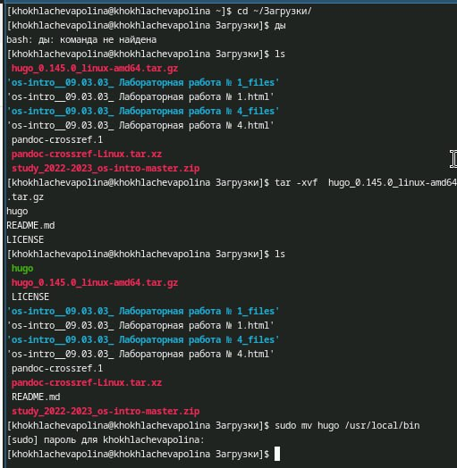
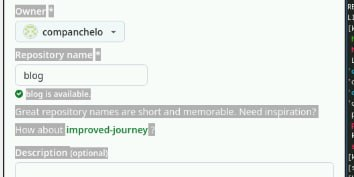
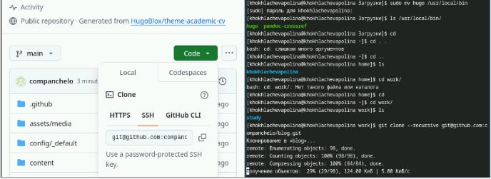
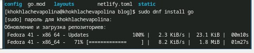
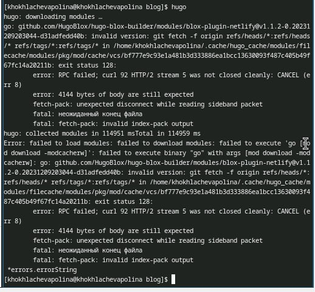
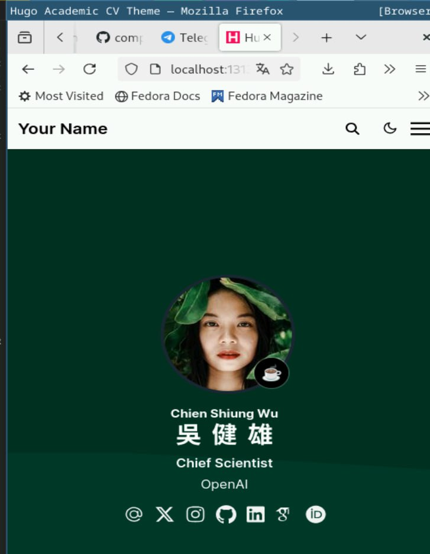
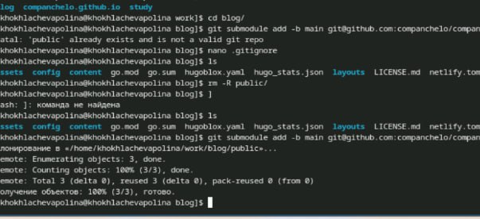

---
## Front matter
lang: ru-RU
title: Лабораторная работа №1
subtitle: Этап 1
author:
  - Хохлачёва П.Д.
institute:
  - Российский университет дружбы народов, Москва, Россия

## i18n babel
babel-lang: russian
babel-otherlangs: english

## Formatting pdf
toc: false
toc-title: Содержание
slide_level: 2
aspectratio: 169
section-titles: true
theme: metropolis
header-includes:
 - \metroset{progressbar=frametitle,sectionpage=progressbar,numbering=fraction}
---

## 

распаковка пакета

## 

Задаём имя

## 

клонирование в blog

## git 

Создание репозитория git

## git 

Заполняем параметры пакета

## git 

Конфигурация

## git 

добавление в журнал

